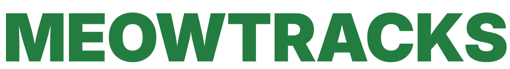
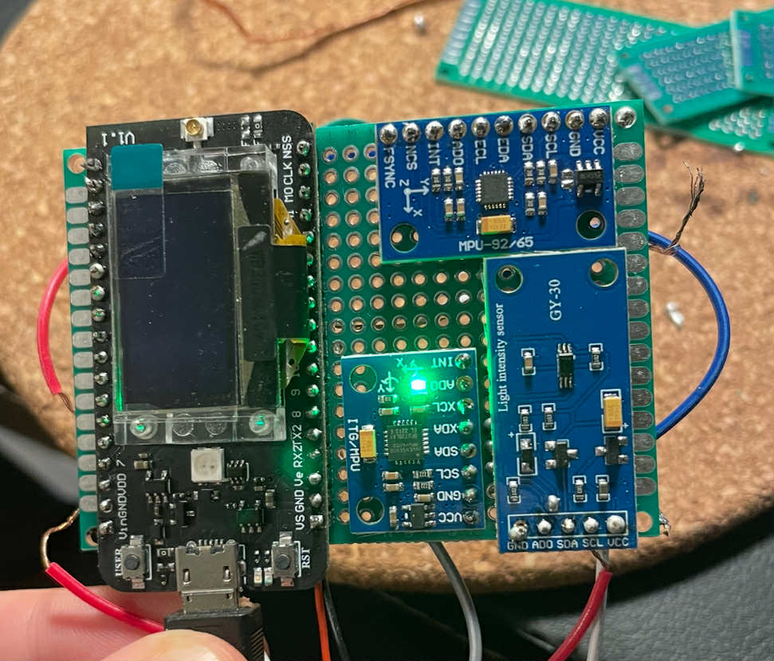
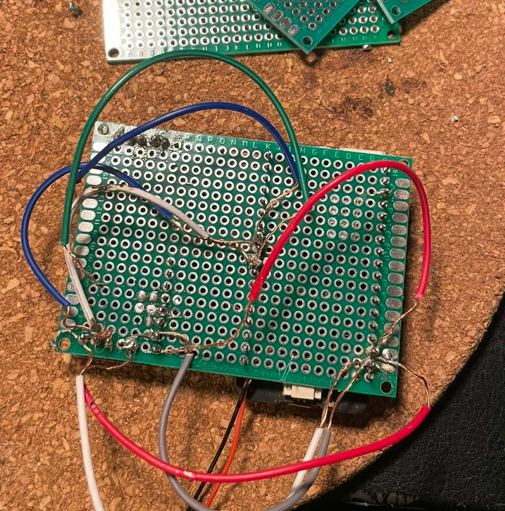
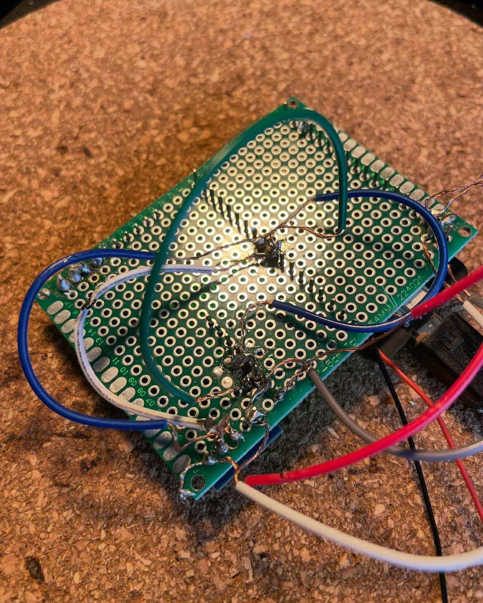

<!-- # <span style="font-family: 'JetBrains Mono', monospace;">Meowtracks</span> -->

<!-- logo image (image folder) -->

<!--  -->

## 

## 📜 Description

Meowtracks is a smart GPS and activity tracker for cats, designed to monitor location and activity levels. The system sends data from a Heltec Cubecell to a T-beam over LoRa, which in turns uses wifi to send the received data to a Node.js backend with MongoDB storage. This makes it so users can get regular updates on their cat's whereabouts and behavior.

## ⚙️ Core features

- **Real-time location tracking via GNSS**
- **Location insights and history such as taken routes and favorite spots**
- **Detection of abnormal low activity levels**
- **Data transmission over LoRa and WiFi**
- **Activity monitoring using an accelerometer (MPU)**
- **Alerts for when crossing geofences**
- **Remote controlled buzzer**
- **Visualization through a mobile app**
- **User-friendly and cat-friendly hardware enclosure**

## 📦 Tech stack

- **Hardware:** LilyGO T-Beam v1.2 (ESP32 + GNSS + MPU6050)
- **Backend:** Node.js + Express
- **Database:** MongoDB (cloud)
- **Frontend:** React Native (for mobile interface)
- **Protocol:** HTTP over WiFi

## 🔧 Installation

### Mobile app

```bash
git clone <https://github.com/EHB-MCT/final-work.git>
cd final-work
npm install
npx expo start // using the Expo Go app on your mobile device
```

### Hardware

- Download Arduino IDE
- Go to file > Preferences > Additional Board Manager URLs
- Add the following URLs:
  - http://resource.heltec.cn/download/package_CubeCell_index.json
  - https://dl.espressif.com/dl/package_esp32_index.json
- Go to Tools > Board > Board Manager
  Install the ESP32 board package and the Heltec board package
- Upload the firmware to the each board (found in firmware/)

## 📸 Screenshots and media

<div style="display: flex; flex-wrap: wrap; gap: 20px; justify-content: center; margin-bottom: 50px;">


## </div>

<div style="display: flex; flex-direction: column; align-items: center;">



</div>
## 📚 Resources

- **AsyncStorage in React Native**  
  Officiële doc:  
  https://react-native-async-storage.github.io/async-storage/docs/install/

- **AsyncStorage basics & best practices (medium artikel):**  
  https://medium.com/react-native-training/react-native-asyncstorage-2021-33a781550601

- **React Native Image Picker (expo-image-picker)**  
  Expo docs over Image Picker:  
  https://docs.expo.dev/versions/latest/sdk/imagepicker/

- **React Navigation - useFocusEffect**  
  useFocusEffect hook om actie te triggeren als screen in focus komt:  
  https://reactnavigation.org/docs/use-focus-effect/  
  Uitleg en voorbeeld:  
  https://reactnavigation.org/docs/use-focus-effect/#example

- **React Native state management tips**  
  Hoe je component state kan syncen met AsyncStorage en updates kan doorvoeren:  
  https://reactnative.dev/docs/state  
  Patterns voor state synchronisatie:  
  https://reactjs.org/docs/hooks-effect.html

- **React Native Maps & Markers**  
  react-native-maps documentatie:  
  https://github.com/react-native-maps/react-native-maps  
  Gebruik van Marker met custom images:  
  https://github.com/react-native-maps/react-native-maps/blob/master/docs/marker.md#custom-markers

- **React Native UI and styling tips**  
  Styling en positionering (flexbox en absolute positioning):  
  https://reactnative.dev/docs/layout-props

- **React Native maps - custom map styling**
  https://chatgpt.com/share/684f1125-52c4-8008-bcd6-825bc86b809d

- **Arduino interpretation of NMEA sentences**
  https://chatgpt.com/share/684f11cf-0f78-8008-b088-f33134470728

- **Persononal Reddit post asking for help with fixing our T-Beam (power was being cuf off when turning the device on)**
  https://www.reddit.com/r/meshtastic/comments/1kr69ek/did_i_brick_my_t_beam_newbie_question/

- **Advice regarding the T-Beam's battery and gps antenna**
  https://chatgpt.com/share/684f13ba-d6a8-8008-a7c8-8ef43ab9f3e9

- **Navigation bar**
  https://github.com/valisoftworks/Enhanced-Fluid-Bottom-Navigation-Bar

**Testing notification with Postman**
https://chatgpt.com/share/68af2533-192c-8002-b91c-a5474f03bbb8

## 🧑‍💻 Authors

- Mikolaj Buelens
- Rowan Biets
