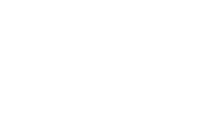
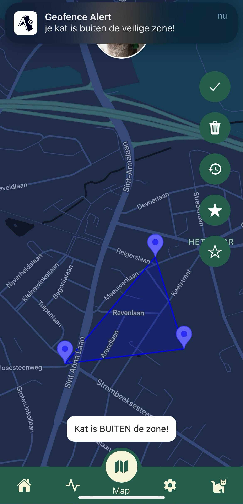

<!-- # <span style="font-family: 'JetBrains Mono', monospace;">Meowtracks</span> -->

<!-- logo image (image folder) -->

<!--  -->

## 

## 📜 Description

Meowtracks is a smart GPS and activity tracker for cats, designed to monitor real-time location, activity levels, and abnormal movement patterns. The system sends data from an ESP32-based T-Beam directly via WiFi to a Node.js backend with MongoDB storage. This allows cat owners to receive timely alerts about potential health risks or dangerous situations.

---

## ⚙️ Core features

- 🐾 **Real-time location tracking via GNSS**
- 📊 **Activity monitoring using an accelerometer (MPU)**
- ⚠️ **Detection and analysis of abnormal movement patterns**
- 🌐 **Direct data transmission over WiFi (no LoRa)**
- 📡 **Visualization through a mobile app**
- 🐈 **User-friendly and cat-friendly hardware enclosure**

---

## 📦 Tech stack

- **Hardware:** LilyGO T-Beam v1.2 (ESP32 + GNSS + MPU6050)
- **Backend:** Node.js + Express
- **Database:** MongoDB (cloud)
- **Frontend:** React Native (for mobile interface)
- **Protocol:** HTTP over WiFi

---

## 📂 Folder structure

```

final-work/
├── finalwork-backend/
│ ├── src/
│ ├── .env.example
│ ├── package.json
│ └── README.md
├── esp32-firmware/
│ ├── src/
│ ├── platformio.ini
│ └── README.md
├── finalwork/
│ ├── assets/
│ ├── src/
│ ├── app.json
│ ├── package.json
│ └── README.md
├── README.md


```

---

## 🔧 Installation

### 1. ESP32 Firmware

- Installeer Arduino IDE
- Voeg de ESP32 board manager toe via de board URL
- Flash de firmware op de T-Beam met juiste WiFi- en endpointconfiguratie

### 2. Backend (Node.js)

```bash
cd finalwork-backend
npm install
npm run dev
```

Zorg ervoor dat `.env` een geldige MongoDB URI bevat.

### 3. Mobiele app

```bash
cd final-work
npm install
npx expo start // using the Expo Go app on your mobile device
```

---

## 📸 Screenshots and media

<div style="display: flex; flex-wrap: wrap; gap: 20px; justify-content: center; margin-bottom: 50px;">




## </div>


## 📚 Resources

- **AsyncStorage in React Native**  
  Officiële doc:  
  https://react-native-async-storage.github.io/async-storage/docs/install/

- **AsyncStorage basics & best practices (medium artikel):**  
  https://medium.com/react-native-training/react-native-asyncstorage-2021-33a781550601

- **React Native Image Picker (expo-image-picker)**  
  Expo docs over Image Picker:  
  https://docs.expo.dev/versions/latest/sdk/imagepicker/

- **React Navigation - useFocusEffect**  
  useFocusEffect hook om actie te triggeren als screen in focus komt:  
  https://reactnavigation.org/docs/use-focus-effect/  
  Uitleg en voorbeeld:  
  https://reactnavigation.org/docs/use-focus-effect/#example

- **React Native state management tips**  
  Hoe je component state kan syncen met AsyncStorage en updates kan doorvoeren:  
  https://reactnative.dev/docs/state  
  Patterns voor state synchronisatie:  
  https://reactjs.org/docs/hooks-effect.html

- **React Native Maps & Markers**  
  react-native-maps documentatie:  
  https://github.com/react-native-maps/react-native-maps  
  Gebruik van Marker met custom images:  
  https://github.com/react-native-maps/react-native-maps/blob/master/docs/marker.md#custom-markers

- **React Native UI and styling tips**  
  Styling en positionering (flexbox en absolute positioning):  
  https://reactnative.dev/docs/layout-props

- **React Native maps - custom map styling**
  https://chatgpt.com/share/684f1125-52c4-8008-bcd6-825bc86b809d

- **Arduino interpretation of NMEA sentences**
  https://chatgpt.com/share/684f11cf-0f78-8008-b088-f33134470728

- **Persononal Reddit post asking for help with fixing our T-Beam (power was being cuf off when turning the device on)**
  https://www.reddit.com/r/meshtastic/comments/1kr69ek/did_i_brick_my_t_beam_newbie_question/

- **Advice regarding the T-Beam's battery and gps antenna**
  https://chatgpt.com/share/684f13ba-d6a8-8008-a7c8-8ef43ab9f3e9

- **Navigation bar**
- https://github.com/valisoftworks/Enhanced-Fluid-Bottom-Navigation-Bar

---

## 🧑‍💻 Authors

- Mikolaj Buelens
- Rowan Biets
